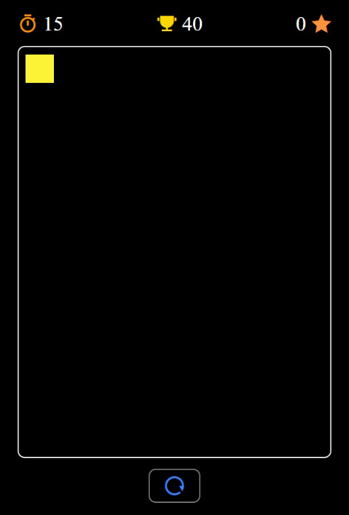

# 🎯 Color Blitz

A fast-paced browser game built with Vanilla JavaScript where players click a randomly moving colored box to score points before the timer runs out. The game features dynamic colors, sound effects, high score tracking, and a clean responsive interface.

## 🌐 Live Demo

https://color-blitz-game-sudhanshu.pages.dev/

## 📸 Preview

  

## ✨ Features

* 🎨 Random Box Colors
* 📍 Random Box Positioning
* ⏱️ 30-Second Countdown Timer
* ⭐ Real-Time Score Tracking
* 🏆 High Score Storage using Local Storage
* 🔊 Sound Effects for Game Events
* 🔄 Restart Game Functionality
* 📱 Responsive Design
* ⚡ Smooth DOM Manipulation

## 🛠️ Tech Stack

* HTML5
* CSS3
* JavaScript (ES6)
* Local Storage API
* Remix Icons

## 🎯 Skills Demonstrated

* DOM Manipulation
* Event Handling
* Timers & Intervals
* Local Storage Management
* Dynamic Styling
* Random Number Generation
* Responsive UI Design
* Game State Management

## 🚀 Future Improvements

* Difficulty Levels
* Leaderboard System
* Pause & Resume Feature
* Power-Ups & Bonus Points
* Animations & Visual Effects
* Multiplayer Mode

## 👨‍💻 Author

**Sudhanshu Shukla**

[GitHub](https://github.com/ErSudhanshuShukla) | [LinkedIn](https://www.linkedin.com/in/ErSudhanshuShukla)
